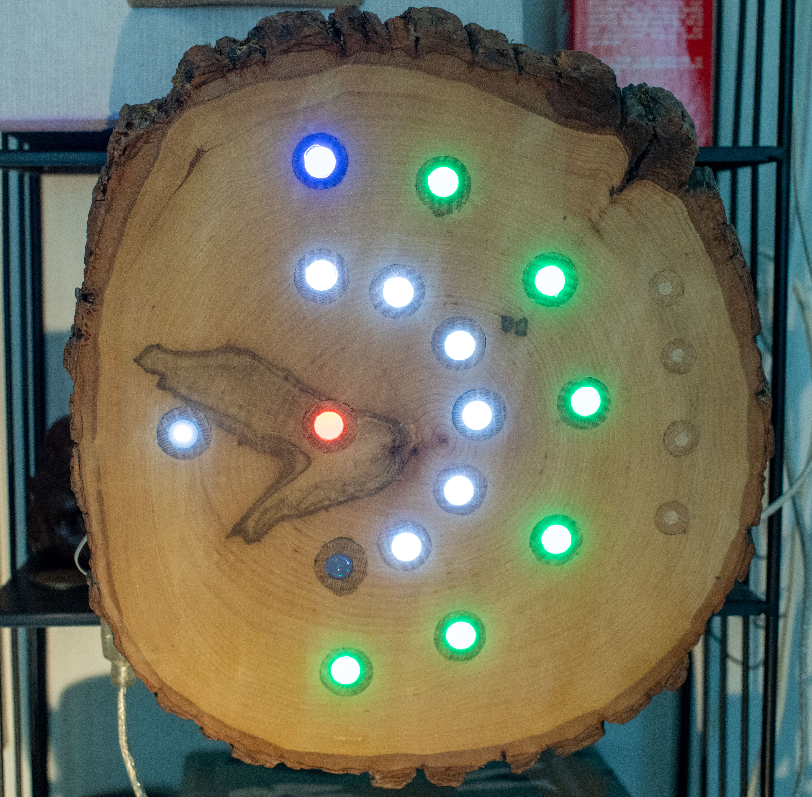

# Clock16
This project presents digital 24 hours clock.  While having only sixteen LEDs it shows time with 15 seconds precision.

## How to Read the Time. WEB Model
Here is web model which helps to understand project interface. Model has four clocks. They all synchronized and show the same time.
 
1. First clock at the left is the regular analogous clock. Nothing to comment here.
2. Second clock works similarly to the first, apart of the fact that in place  of clock hands there are arches. Regular clock shows time by  angles between hands and  vertical axis. This clock shows time by angles occupied by arches (outer arch for minutes, inner arch for hours ).
3. Third picture  is not full dial but only half-dial. For hours less than 6 and minutes less than 30  reading the time is not different of the previous clock. But when hours are in the range 6..12 and minutes in the range 30..60 there is the change. Hands of the regular clock under these conditions  are positioned in the left side of dial. But there is no left side of the dial for this arch clock. So direction how arches grow changes. Now arches start not at the twelve mark but at the six  mark. That way it can show hours from 6 to 11 and minutes from 30 to 60.
4. Fourth  clock is similar to third but arches instead of solid become dotted. Meaning of each hour dot  (when white) is similar to the meaning of hours mark for a regular clock.   Meaning of each minute dot (when green) is similar to a meaning of five minute mark for a regular clock. One minute precision provided by a color of the last dot of minute arch. Just add color reading to the time provided by green dots (for cyan add +1, for purple add +2, for red add +3, and for blue add +4 ).  This last model is very close to the real LED based clock.  

Model allows to play with clocks dynamically. Three modes exist:
1. Manual mode. Top slider allows to change clock setting.
2. Real time mode. Clock shows current local time on the machine where browser is running.
3. Simulated mode. Time change is simulated (bottom slider allows to increase or decrease simulation speed).

You can work with model by clicking this link: [half-dial-web-model](https://filedn.com/lRLB6A8XqsC4voY39bLNwCj/Clock16/)
If you don't like clicking unknown link you may deploy the model locally. Just clone this git repository, go to the directory p5model, and open index.html file with browser of your choice.

Real LED clock is different of model  by having two more LEDs. Central LEDs changes color each 15 seconds. When clock is in set mode this LED is dark.  One more LED on the left part of the clock is PM LED. It is off when time is the range 12 AM ... 12 PM. Otherwise it is on. 

## Components and Circute
Here is list of project components.

1. Atmega328p Microchip processor
2. Five 10mm tri-color  common cathod LEDs
3. Three 10mm tri0color common anod LEDs
4. Seven 10mm white LEDs
5. 5mm white LED
6. Sixteen 75 Ohm/0.125 W  resistors
9. Eleven silicon diods 1N4148
10. Shotkey diod 1N5817
11. Three  micro buttons
12. Super Capacitor 0.5 MF 5.5 V
13. Power down supply LM2596
14. Crystal 32768 KHZ
15. Opto-pair NTE3042
16. Resistor 220 Ohm/ 0.125 W

 

 Each multi-color LED consists of three color LEDs, so overall there are 32 LEDs. Single pin in this circute controls  two LEDs.  

## Program

TO program device I used Microchip studio. Program written in C language and complied by XC8 compiler. Code I  uploaded to microprocessor with the help of AVRISPII interface.

