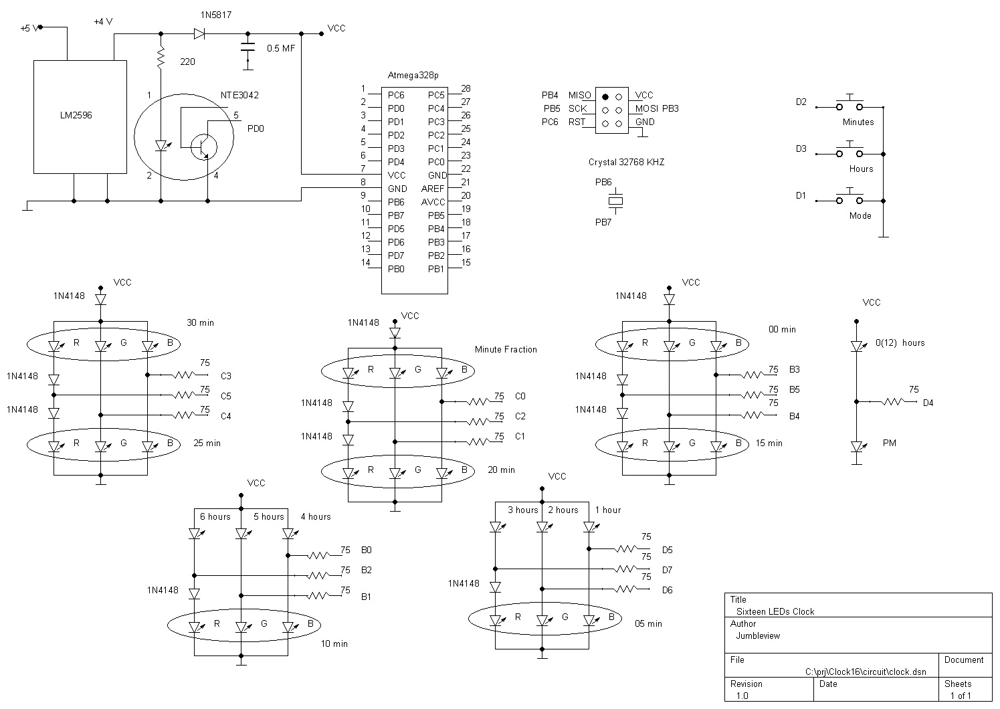
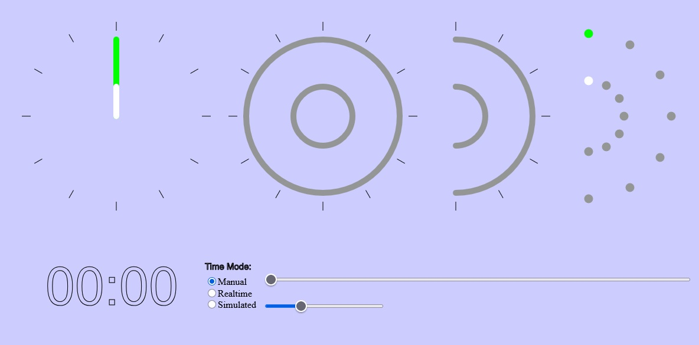

# Clock16
This project presents digital 24 hours clock.  WHile having only only sixteen LEDs it shows time with 15 seconds precision.

## How to Read the Time. Model

 

## Component and Circute

 

## Program

