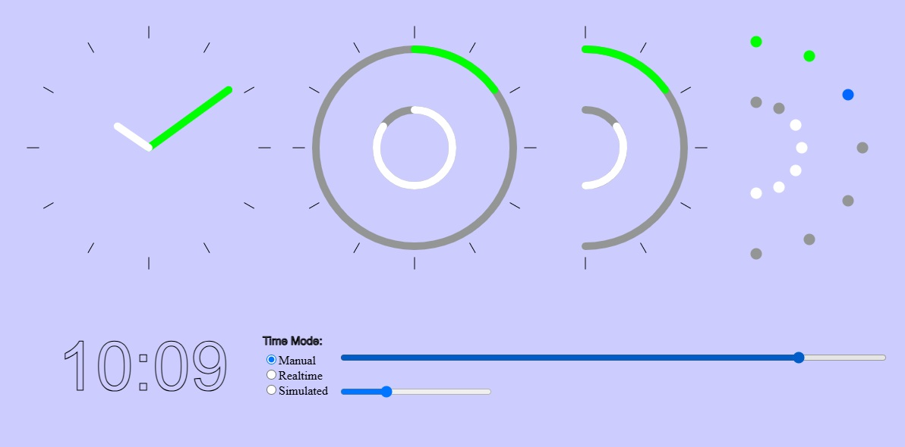

# Clock16
This project presents digital 24 hours clock.  While having only sixteen LEDs it shows time with 15 seconds precision.

## How to Read the Time. WEB Model
Here is web model which helps to understand project interface. You can work with model by clicking this link: [half-dial-web-model](https://filedn.com/lRLB6A8XqsC4voY39bLNwCj/Clock16/) If you don't like clicking unknown link you may deploy the model locally. Just clone this repository, go to the directory p5model, and open index.html file with browser of your choice.
Model has four clocks. They all synchronized and show the same time.
 
1. First clock at the left is the regular analogous clock. Nothing to comment here.
2. Second clock works similarly to the first, apart of the fact that in place  of clock hands there are circular arcs. Normally clock shows time by  angles between vertical axis and hands . This arc clock shows time by angles occupied by arcs (outer arc for minutes, inner arc for hours ). Arcs start at twelve mark and grows clockwise. 
3. Third clock has ark as well but instead of clock dial there is only half-dial. For hours less than six and minutes less than thirty  reading the time is not different of the previous clock. Arcs start at twelve mark and grows clockwise. But when hours are in the range 6..12 or minutes are in the range 30..60 there is the change. Hands of the regular clock under these conditions  are positioned at the left side of dial. But for this arc clock there is no left side. Arcs occupies the same right side but starting point   and direction  how arcs grow changes. Under these conditions arcs start not at the twelve mark but at the six  mark and they grow counter-clockwise. That way clock show hours from 6 till 12 and minutes from 30 till 60.
4. Fourth  clock is similar to the third but arcs are dotted not solid. This clock does not need dial marks: dots itself are marks. White dots of inner galf-dial shows hours, green dots of outer  arc show time with five minutes precision. Additional  one minute precision achieved by a color of the last dot of minute arc. Just add color reading to the time provided by green dots (for cyan add +1, for purple add +2, for red add +3, and for blue add +4 ).  This last clock model is very close to the real LED based clock  (just substitute dot with LED). 

Model allows to play with clocks dynamically. Three modes exist:
1. Manual mode. Top slider allows to change clock setting.
2. Real time mode. Clock shows current local time on the machine where browser is running.
3. Simulated mode. Time change is simulated (bottom slider allows to increase or decrease simulation speed).

Real LED clock is different of dot half-dial model  by having two more LEDs. 
1. Central LEDs changes color each 15 seconds. When clock is in set mode this LED is dark.  
2. LED on the left part of the clock. It is PM LED. This LED is off when time is in the range 12 AM ... 12 PM. Otherwise it is on. 

## Components and Circute
Here is list of project components.

1. Atmega328p Microchip processor
2. Five 10mm tri-color  common cathod LEDs
3. Three 10mm tri0color common anod LEDs
4. Seven 10mm white LEDs
5. 5mm white LED
6. Sixteen 75 Ohm/0.125 W  resistors
9. Eleven silicon diodes 1N4148
10. Schottky diode 1N5817
11. Three  micro buttons
12. Super Capacitor 0.5 MF 5.5 V
13. Power down supply LM2596
14. Crystal 32768 KHZ
15. Opto-pair NTE3042
16. Resistor 220 Ohm/ 0.125 W

 

 Each multi-color LED consists of three color LEDs, so overall there are 32 LEDs. Single pin in this circute controls  two LEDs.  
 Circute has power down supply, converting 5V power to ~4 v. It is needed to avoid weak LED lighting when chip pin  takes in-no-pull-up mode (program set it  when  LED should be off). 
 Super-capacitor and schottky diode allows to keep clock running in case of occasional power loss. Opto-pair delivers signal of the power loss to the microchip and program may switch all LEDs off  to prolong clock work while power is down.

## Program

To program device I used Microchip Studio. Program written in C language and complied by XC8 compiler. AVRISPII interface device allows to upload compiled code to the microprocessor memory.

